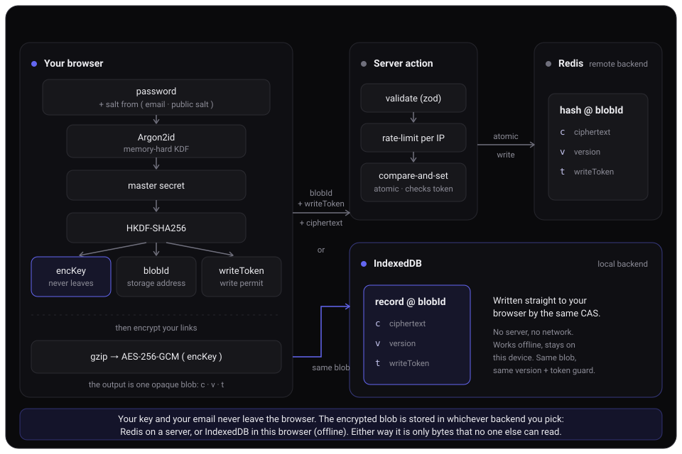

<h1>
  
  Blinks
</h1>

Blinks is a private place to save links. Everything is encrypted inside your browser. You unlock it with one password. The server never sees your password or your links. It only ever holds a blob of bytes it cannot read.

Live demo: [add your demo link here]. It is there just for fun, so try it if you want.

## One password is the whole account

No sign up. No email. No username. No "forgot password" link.

Your password does two jobs at once: it is the **key** that encrypts your links, and it points to the **address** where they are stored. Type it and you open your vault. Type a different one and you get a different, empty vault. There is no "correct" password, because there is nothing on the server to check against.

So two things follow. Lose your password and the data is gone for good, since a reset would let someone in without it. And your password is the only lock, so anyone who has it can open your vault. Treat it like the master key it is.

To help, Blinks can generate a 200 character random password in one click and copy it to your clipboard. That is enough entropy that no two people will ever land on the same one and brute-force can't happen because of design and rate limiting.

> Note: This is a personal project to explore zero knowledge architecture, where the server truly cannot read your data. For a real product, I would also add email and 2FA, for security and for marketing and personalization.

## How it works

<p align="center">
  
</p>

Step by step:

1. Your password and a fixed public salt go into Argon2id, a slow and memory heavy function. It returns a master secret.
2. HKDF splits that secret into three independent parts: `encKey` (an AES-256 key), `blobId` (a hex address), and `writeToken` (a write permit).
3. Your whole vault, its title and every link, gets gzipped, then encrypted as one payload with AES-256-GCM using `encKey`.
4. The browser sends `blobId`, the ciphertext, and `writeToken` to a server action.
5. The server validates the input, rate limits by IP, and writes the blob into Redis at `blobId`. It writes only if the version still matches (so two open tabs never overwrite each other) and only if the `writeToken` matches the one stored on the first write.

The point to notice: `encKey` never leaves the browser. The server and Redis only ever hold ciphertext. Even the number of links stays hidden, because the whole vault is one opaque blob.

### Why the write token

`blobId` is an address, and the browser sends it on every read, so on its own it is only a pointer, not a permission. If it ever leaked, someone could not read your links (they are encrypted), but they could try to overwrite or wipe the blob sitting at that address.

`writeToken` closes that gap. It is a third value derived from your password, independent from the key and the address, and the server stores it the first time you write. After that, every write must present the matching token or it is refused. So an address alone is never enough to change your data. And because `writeToken` cannot decrypt anything, storing it on the server changes nothing about the zero knowledge guarantee: the server still only holds bytes it cannot read.

## Tech stack

- Next.js 16 (App Router, React 19, React Compiler)
- TypeScript and Tailwind CSS v4
- Upstash Redis over REST, with per IP rate limiting
- hash-wasm (Argon2id) and the Web Crypto API (AES-GCM, HKDF)

## The Encryption

- **Key derivation:** Argon2id (64 MB of memory, 3 passes). This makes guessing a password slow and expensive, even for someone holding the ciphertext.
- **Cipher:** AES-256-GCM with a fresh random IV on every write. GCM also verifies the data was not tampered with.
- **Key split:** HKDF-SHA256 with separate labels, so the storage address, the encryption key, and the write token stay independent.
- **Write authorization:** a `writeToken` (a third HKDF output) proves you hold the password before any write lands. Reads need only the `blobId`; writes need the token too, so a leaked address alone cannot corrupt or wipe your vault. The token cannot decrypt anything.
- **No login to attack:** a wrong password lands on a different `blobId` (which is empty) or fails the GCM check. There is nothing to brute force, because there is no login step.

### A note on quantum

Blinks relies on symmetric crypto (AES and hashing). It does not use RSA or elliptic curve keys for the vault. That is exactly what matters for the quantum question.

Shor's algorithm is the quantum attack that breaks RSA and elliptic curve keys. Blinks uses none of those, so it has nothing for Shor to break. The best known quantum attack on AES-256 is Grover's algorithm, and it only takes the square root of the work. AES-256 still leaves about 128 bits of strength against a quantum computer, which is far past anything that could ever be built.

So Blinks is **quantum-resistant**. This is not the same as "post-quantum". Post-quantum usually means new public key schemes designed to survive quantum computers. Blinks takes a simpler road: it does not use the public key crypto that quantum computers threaten in the first place.

## Setup

You need Node 20 or newer and pnpm.

1. Clone and install.

   ```bash
   git clone https://github.com/your-name/blinks.git
   cd blinks
   pnpm install
   ```

2. Create a database in Upstash Redis. Make a free one at [upstash.com](https://upstash.com) and copy the REST credentials from its dashboard.

3. Copy the example env file and fill it in.

   ```bash
   cp .env.example .env
   ```

   Read the comments in `.env.example`. The one value to think about is `NEXT_PUBLIC_KDF_SALT`. Pick a long random string once and never change it. If it changes, your saved links stop opening. You can generate a good one with:

   ```bash
   openssl rand -hex 32
   ```

4. Run it.

   ```bash
   pnpm dev
   ```

   Open [http://localhost:3000](http://localhost:3000) and type a password. That password is now your vault.

## Deploy

You can use Blinks locally without any issues, but if you want to make it available as a normal website, you can deploy them anywhere that runs Next.js.

1. Push the repo to your Git host.
2. Point your host at the repo and build it.
3. Add the same environment variables from `.env`.
4. Make sure `NEXT_PUBLIC_KDF_SALT` matches the value you used locally, or your existing links will not open.

## Good to know

- Your key and write token survive a page refresh but clear the moment you close the tab. They live in `sessionStorage`.
- Some sites, especially those using Cloudflare, uses bot protection (the “Just a moment…” page). For those sites, Blinks falls back to displaying the hostname. They should work in Local because the metadata request comes from your device, but they will fail in the production server.
- No tracking. No analytics. No third party scripts. The content security policy blocks outside scripts by design.

## License

AGPL-3.0-only © [Yusif Aliyev](https://yusifaliyevpro.com)
